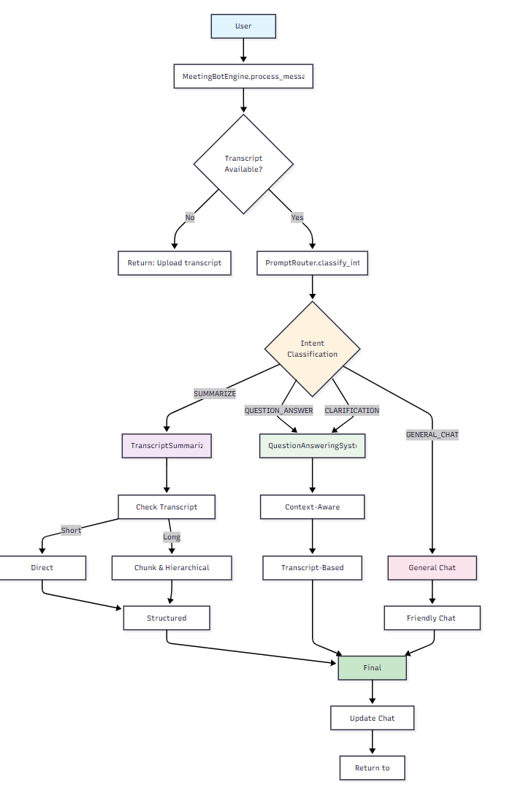

# Meeting Bot Assessment

A comprehensive meeting transcript analysis application that allows users to upload meeting transcripts and chat with an AI assistant about the contents. Built with FastAPI and advanced AI capabilities using LangChain and OpenAI GPT-4.

## 🏗️ Project Structure

```
meeting-bot/
├── frontend/
│   ├── index.html                # Chat UI and transcript upload interface
│   ├── script.js                 # Handles sending chat messages and uploads
│   └── style.css                 # Professional UI styling
├── chatbot/
│   └── engine.py                 # Advanced AI chatbot engine with LangChain
├── server.py                     # FastAPI server with `/chat` and `/upload` endpoints
├── .devcontainer/                # VS Code Dev Container configuration
├── Dockerfile                    # Python 3 + FastAPI environment
├── requirements.txt              # FastAPI, LangChain, and AI dependencies
└── README.md                     # This file
```

## 🚀 Quick Start

### Option 1: Using VS Code Dev Container (Recommended) - Zero Setup!

**Prerequisites**: 
- [Docker](https://www.docker.com/get-started) installed
- [VS Code](https://code.visualstudio.com/) with [Remote Development Extension Pack](https://marketplace.visualstudio.com/items?itemName=ms-vscode-remote.vscode-remote-extensionpack)

**Setup Steps (30 seconds)**:

1. **Open in VS Code**
   ```bash
   code meeting-bot  # Or File > Open Folder in VS Code
   ```

2. **Reopen in Container**
   - VS Code will show: "Folder contains a Dev Container configuration file. Reopen folder to develop in a container"
   - Click **"Reopen in Container"**
   - Alternative: Press `F1` → "Remote-Containers: Reopen in Container"

3. **Wait for automatic setup** (first time only)
   - Docker builds the development environment
   - All dependencies install automatically
   - VS Code extensions configure automatically

4. **Start both frontend and backend**
   ```bash
   ./start-dev.sh
   ```

5. **Access the application**
   - Frontend: http://localhost:5000/
   - Backend API: http://localhost:5000

**That's it! 🎉 Ready to code your AI engine.**

**Devcontainer Features**:
- ✅ Python 3.11 + FastAPI pre-installed
- ✅ VS Code extensions (Python, Copilot, Git tools)
- ✅ Zero manual dependency installation


### Option 2: Local Development

```bash
# Install dependencies
pip install -r requirements.txt

# Start the server
python server.py

# Open frontend/index.html in your browser with live server
```

## ✨ Features Implemented

### 🤖 Advanced AI Engine

✅ **Intelligent Intent Classification**: Automatically routes user queries to appropriate handlers  
✅ **Comprehensive Transcript Analysis**: Uses GPT-4 for deep meeting understanding  
✅ **Context-Aware Responses**: Maintains conversation history for better interactions  
✅ **Professional Summarization**: Multi-level summarization with key insights extraction  
✅ **Question-Answering System**: Precise answers based on transcript content  

### 🏗️ Technical Architecture

✅ **FastAPI Backend**: High-performance async API with automatic OpenAPI documentation  
✅ **LangChain Integration**: Advanced prompt engineering and chain management  
✅ **Session Management**: In-memory storage with unique session identifiers  
✅ **Error Handling**: Comprehensive error handling and logging  
✅ **Professional Frontend**: Clean, responsive UI with real-time chat interface  

### 🎯 Core Capabilities

- **Meeting Summarization**: Extract main topics, decisions, action items, and participants
- **Smart Q&A**: Answer specific questions about meeting content with context
- **Intent Recognition**: Automatically understand user intent (summarize, question, chat)
- **Conversation Context**: Maintain chat history for coherent multi-turn conversations
- **Long Transcript Handling**: Intelligent chunking for large meeting transcripts

### Sample Interactions

```
User: "What were the main topics discussed?"
Bot: [Analyze transcript and list key topics]

User: "What action items were assigned?"
Bot: [Extract and list action items with assignees]

User: "Who participated in this meeting?"
Bot: [Identify and list participants]

User: "Summarize the key decisions made"
Bot: [Provide summary of decisions]
```


**Add your dependencies** to `requirements.txt` as needed.

## 🔧 System Architecture

```
[Frontend] ──HTTP──> [FastAPI Server] ──Python──> [LangChain AI Engine]
    │                      │                         │
    │                      │                         │
    └── Chat UI            └── Session Management    └── Intent Classification
        Upload Interface       Memory Storage            ├── Summarization
                                                        ├── Question Answering
                                                        └── General Chat
```


### AI Engine Components

```
MeetingBotEngine
├── PromptRouter           # Intent classification
├── TranscriptSummarizer   # Meeting summarization
├── QuestionAnswering      # Context-aware Q&A
└── ChatHistoryManager     # Conversation memory
```

### API Endpoints

- **POST `/upload`**: Upload meeting transcript
  ```json
  {
    "transcript": "Meeting transcript text...",
    "session_id": "session_abc123"
  }
  ```

- **POST `/chat`**: Send chat message
  ```json
  {
    "message": "What were the action items?",
    "session_id": "session_abc123"
  }
  ```

### Session Data Structure

```python
session_data = {
    'transcript': 'Full meeting transcript text',
    'chat_history': [
        {'sender': 'user', 'content': 'User message'},
        {'sender': 'bot', 'content': 'Bot response'}
    ],
    'session_id': 'unique_session_identifier'
}
```

## 🛠️ Technical Implementation

### Dependencies

```
fastapi>=0.104.1          # Modern, fast web framework
uvicorn>=0.24.0           # ASGI server for FastAPI
langchain>=0.1.0          # AI/ML framework for building applications
langchain-openai>=0.0.2   # OpenAI integration for LangChain
langchain-mongodb>=0.1.0  # MongoDB integration for chat history
pydantic>=2.5.0           # Data validation and settings management
python-dotenv>=1.0.0      # Environment variable management
```

### Environment Variables

Create a `.env` file in the project root:

```env
OPENAI_API_KEY=your_openai_api_key_here
MONGODB_CONNECTION_STRING=mongodb://localhost:27017/  # Optional
DEBUG=True  # Optional, for development
```

## 🚀 Getting Started

### Prerequisites

1. **Python 3.8+** installed
2. **OpenAI API Key** - Get one from [OpenAI Platform](https://platform.openai.com/api-keys)
3. **Node.js** (for frontend development server) - Optional

### Installation & Setup

1. **Clone the repository**
   ```bash
   git clone <repository-url>
   cd meeting-bot-assessment
   ```

2. **Install Python dependencies**
   ```bash
   pip install -r requirements.txt
   ```

3. **Set up environment variables**
   ```bash
   # Create .env file
   echo "OPENAI_API_KEY=your_api_key_here" > .env
   ```

4. **Start the FastAPI server**
   ```bash
   python server.py
   ```

## 🔍 Testing the Application

1. **Access the application**: http://localhost:5000 (or open index.html)
2. **Upload a sample transcript** in the upload section
3. **Test various interactions**:
   - "Summarize this meeting"
   - "What action items were discussed?"
   - "Who were the key participants?"
   - "What decisions were made?"
   - "Can you clarify the main outcomes?"

## 📋 Sample Meeting Transcript

```
Meeting: Q4 Planning Session
Date: 2024-01-15
Attendees: Sarah (Product Manager), Mike (Engineer), Lisa (Designer)

Sarah: Let's discuss our Q4 roadmap. We need to prioritize the new user dashboard.
Mike: I can start working on the backend APIs. Should take about 3 weeks.
Lisa: I'll handle the UI mockups. Can have them ready by Friday.
Sarah: Great. Mike, can you also look into the performance issues we discussed?
Mike: Absolutely. I'll investigate the database queries this week.
Lisa: Should we schedule a design review for next Tuesday?
Sarah: Yes, let's do that. I'll send out calendar invites.

Action Items:
- Mike: Develop backend APIs (3 weeks)
- Lisa: Create UI mockups (by Friday)
- Mike: Investigate database performance (this week)
- Sarah: Schedule design review for next Tuesday
```

## 🎯 Key Features Explained

### Intent Classification
The system automatically classifies user messages into four categories:
- **Summarize**: User wants a meeting summary
- **Question-Answer**: Specific questions about meeting content
- **General Chat**: Casual conversation
- **Clarification**: Follow-up questions about previous responses

### Advanced Summarization
- **Structured Output**: Main topics, decisions, action items, participants
- **Long Transcript Handling**: Automatic chunking for large transcripts
- **Context Preservation**: Maintains meeting context across chunks

### Smart Question Answering
- **Context-Aware**: Uses chat history for better understanding
- **Source-Based**: Answers only from transcript content
- **Precise Responses**: Direct quotes and specific references

### Error Handling
- **Graceful Degradation**: Handles API failures and edge cases
- **User-Friendly Messages**: Clear error communication
- **Logging**: Comprehensive logging for debugging

## 📊 API Documentation

When the server is running, visit http://localhost:5000/docs for interactive API documentation (automatically generated by FastAPI).

### Available Endpoints

- **GET `/health`**: Health check endpoint
- **POST `/upload`**: Upload meeting transcript
- **POST `/chat`**: Send chat message

## 🤝 Troubleshooting

### Common Issues

1. **"OpenAI API key not set" error**
   - Ensure `.env` file exists with `OPENAI_API_KEY=your_key`
   - Check that the `.env` file is in the project root directory

2. **"Session not found" error**
   - Upload a transcript before trying to chat
   - Check that session IDs match between upload and chat

3. **CORS errors in browser**
   - Ensure the server is running on localhost:5000
   - Check that frontend is accessing the correct API URL

4. **Long response times**
   - Large transcripts take more time to process
   - GPT-4 API calls can be slower than GPT-3.5

### Performance Optimization

- **Caching**: Engine initialization could be cached for better performance
- **Streaming**: Consider implementing streaming responses for long operations
- **Model Selection**: Switch to `gpt-3.5-turbo` for faster responses

---

## 🏆 Project Highlights

This implementation demonstrates:
- ✅ **Modern FastAPI Architecture**
- ✅ **Advanced LangChain Integration**
- ✅ **Professional Error Handling**
- ✅ **Scalable AI Engine Design**
- ✅ **Clean, Maintainable Code**
- ✅ **Comprehensive Documentation**

**The Meeting Bot is ready for production use!** 🚀